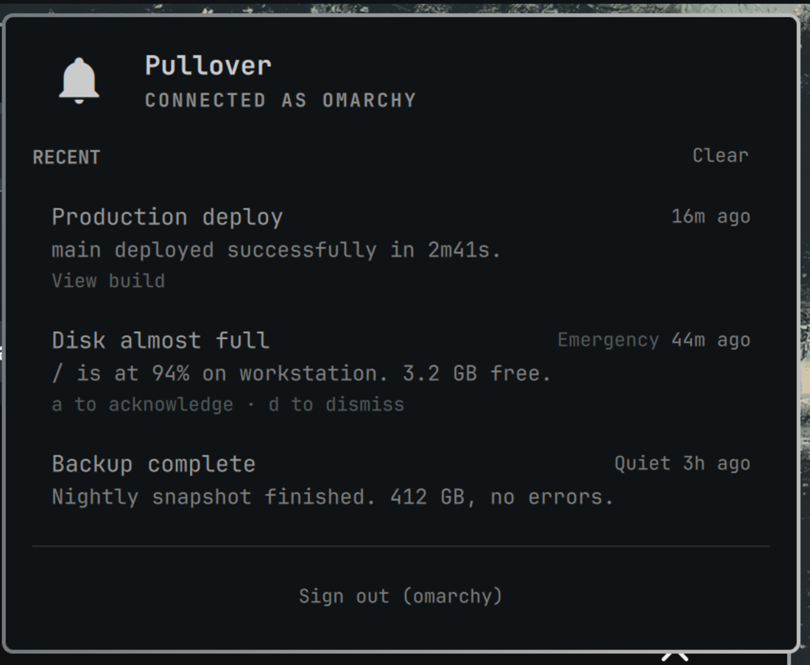

# Pullover

**An unofficial Pushover Open Client for Omarchy. Not released or supported by
Pushover.**

Pushover ships apps for iOS, Android, macOS and the browser, and nothing for
Linux. Pullover is the missing client: pushes arrive on your desktop as native
Omarchy notifications, with a bar widget for the ones you missed.

You need your own Pushover account and licence, both from
<https://pushover.net/>.



## What it does

- **Native notifications** through `omarchy-notification-send`, so they land in
  Omarchy's own notification history and **clicking one opens the message's
  URL**. A normal push carries the sending app's name and icon; a high-priority
  or emergency one trades the app label for the Do Not Disturb bypass (see
  [How it fits into Omarchy](#how-it-fits-into-omarchy)) and names the sender in
  the headline instead.
- **Do Not Disturb respected, and correctly bypassed.** A normal push stays
  silent under DND. High-priority and emergency pushes break through, which is
  what those priorities mean to Pushover.
- **A bell in the bar** with an unread count, and a panel listing recent pushes.
- **Dismiss what you have dealt with** — `d` for one, `Clear` for all.
- **Acknowledge an emergency push** from the desktop.
- **It warns you before the trial ends.**
- **Sign in from the panel.** Installing still needs one terminal command; after
  that there is no config file to hand-edit.

Pushes are delivered to every device on your account **unless the sender
addresses one specifically** — Pushover's API has a `device` parameter, and a
push aimed only at your phone never reaches this machine. Nothing here can
change that.

## How it works

Pushover's [Open Client API](https://pushover.net/api/client) lets a device
register itself and hold a websocket to `client.pushover.net`. The socket
carries no content — single bytes meaning "something changed" — so the client
fetches messages over HTTPS, shows them, and tells the server they landed.

Two pieces, and the first is useful without the second:

| | |
| --- | --- |
| `pullover` | A Python daemon under systemd. Holds the socket, raises the notifications, writes the state file. |
| The bar widget | QML. Reads that state file. Owns sign-in, unread and dismissal. |

## Requirements

- Omarchy 4 or newer (the shell plugin system)
- `python-websockets`, `python-requests`, `libnotify` — `setup` installs these
  with pacman. `libnotify` is only needed for the fallback notification path.
- **A Pushover for Desktop licence.** Free for 30 days from the moment this
  device registers, then a one-time **$4.99** on your account, bought from
  Pushover. A phone or macOS app licence does not cover it.
  <https://pushover.net/clients/desktop>

### About that trial

The published Open Client API documents **no way to read licence or trial
status** — no endpoint, no field, no websocket frame. An unlicensed device
simply stops receiving.

So Pullover counts from the day this device registered and warns you once, as
soon as it notices fewer than 7 days remain, and again at expiry. That is an
estimate from a date, not a reading from Pushover. Once you have paid, say so —
the **Already bought it** button, or `pullover licensed` — and the countdown
stops. Your word is the only source of that fact that exists.

## Install

```bash
omarchy plugin add https://github.com/mishkinf/omarchy-pullover.git
cd ~/.config/omarchy/plugins/io.github.mishkinf.pullover && ./setup
omarchy plugin enable io.github.mishkinf.pullover --section right
```

Then **click the bell and sign in there.** The panel asks for your Pushover
email and password, reveals a two-factor field only if the server asks for one,
registers this machine (named after its hostname by default), and starts the
client.

Your password is never stored and never passed as an argument — it goes to the
client over stdin, because anything in argv is readable by every process on the
machine. What is kept is Pushover's **account session secret**, at
`~/.config/pullover/credentials.json`, mode 600. That secret is account-scoped,
not device-scoped: treat that file as you would the password.

### Uninstall

```bash
./uninstall              # stop and remove the client, keep the login
./uninstall --forget     # also delete the stored credentials
omarchy plugin remove io.github.mishkinf.pullover
```

Two things it deliberately does not do. **The device stays registered on your
Pushover account** — the API documents no way to remove one, so retire it at
<https://pushover.net/devices>; it holds one of your ten slots. And the three
pacman packages stay installed, since other things may use them.

## Using it

| | |
| --- | --- |
| Click the bell | open the panel, which marks everything read |
| Right-click | re-read the state |
| `j` / `k` | move the cursor (the first press only shows it) |
| `Enter` / `o` | open the selected message's URL, or acknowledge it if it has none |
| `a` | acknowledge an emergency-priority push (remembered locally — the server never tells us again) |
| `d` | dismiss the selected message |
| `r` | refresh |

Dismissing is this widget's own idea, like unread: the daemon keeps what
arrived and the panel decides what is still worth showing. It changes nothing
on your Pushover account. (The daemon does clear the server-side queue for this
device after each sync, which is how the Open Client protocol works — that is
separate from dismissing.)

### Settings

```bash
omarchy bar set io.github.mishkinf.pullover maxVisible 20
omarchy bar set io.github.mishkinf.pullover hideWhenIdle true --json
```

| key | default | |
| --- | --- | --- |
| `hideWhenIdle` | `false` | hide the bell when the client is not running |
| `maxVisible` | `12` | messages listed in the panel (50 are kept) |

⚠️ **`--json` is required for the boolean.** Without it `omarchy bar set` stores
the JSON *string* `"true"`, and every widget in the shell — first-party ones
included — tests `=== true`, so it silently does nothing. `maxVisible` is
unaffected.

### From a terminal

```bash
pullover probe      # signed in? client running? days of trial left?
pullover status     # the state file the widget reads
pullover selftest   # prove the notification path works
pullover ack <receipt>
pullover licensed   # stop the trial countdown
pullover logout
journalctl --user -u pullover -f
```

## When it stops

Two failures stop the client for good, because both need a person. systemd is
told not to restart on them (`RestartPreventExitStatus=78 79`):

- **78** — Pushover disconnected this device. It sends the **same frame** for a
  device it has rejected and for one whose licence has lapsed, and exposes no
  way to tell them apart, so check your licence first and sign in again if that
  is not it.
- **79** — the same device id logged in somewhere else. Two copies of this
  client cannot share one device; register the second under another name.

Everything else — a dropped socket, a flaky network, an API 500, a malformed
payload — is handled and reconnects with a backoff from 5 seconds to 5 minutes.

## How it fits into Omarchy

Worked out by reading the shell rather than guessing, because each of these is
somewhere a plugin can quietly behave badly:

- **Do Not Disturb.** `NotificationLogic.js`'s `shouldBypassDnd` grants the
  bypass to the app name `omarchy-action` unconditionally, and to `notify-send`
  only at critical urgency. It keys on the **app name**, not the urgency — so a
  push sent under its own app name is silenced by DND whatever its priority, and
  a Pushover emergency would have been swallowed. High and emergency pushes
  therefore give up the app label on both the native and fallback paths.
- **Click actions.** Omarchy carries a click action as an `omarchy-exec-argv`
  hint rather than a libnotify action, so it survives a shell restart. A push
  whose URL is `http`/`https` gets one, run as argv and never as a shell string.
- **Body markup.** Omarchy renders a notification body as Qt `StyledText`,
  converts newlines to `<br/>`, and strips ``. So Pushover's `html=1`
  subset is passed through and renders, and a plain-text body is escaped,
  because an unescaped `<` or `&` in a human-written message would otherwise be
  read as markup. (One shell quirk worth knowing: for apps whose name looks
  Chromium-derived, Omarchy also strips a leading URL from the body.)
- **The headline is never allowed into option position.** The sender takes it as
  a positional after its own option loop, so a message titled exactly
  `--urgency` made it exit non-zero and display nothing, and `--app-name=X`
  spoofed the sender. Anything starting with `-` is prefixed with a word joiner.

## Tests

```bash
./test
```

79 tests — 61 Python, 18 Node — needing no network and no Pushover account.
They write only into a temp directory. The Node half is skipped if Node is not
installed.

## Notes for anyone changing this

Each of these is a bug that actually happened here.

- **A Pushover message id is 19 digits.** Past JavaScript's safe-integer range,
  so `JSON.parse` rounds it: id `…742185` was written to the read marker as
  `…742200`, which then matched nothing. Ids are compared as **strings**, and
  unread is a **position**, never a numeric comparison.
- **The secret is a GET query parameter**, so `requests`' own exception text
  quotes it back — and that text was being written to the state file and the
  journal. Everything that records an error redacts it now.
- **A malformed field must not kill the daemon.** A string `id` raised
  `ValueError`, which `run()`'s three-exception handler did not catch; systemd
  restarted into the same batch every 5 seconds, re-notifying each time, forever.
- **A handshake is not a healthy connection.** Resetting the backoff on connect
  meant a server that accepted and immediately dropped was retried every 5s and
  the 5-minute ceiling was unreachable.
- **SIGTERM skips `finally`.** `status.json` survived every normal stop still
  saying `connected: true`.
- **`time.monotonic()` is seconds since boot.** A rate limiter comparing against
  `0.0` is disabled for the first hour of every uptime — and a test for it
  passes or fails depending on the machine's uptime.
- **The daemon adopts the history on disk at startup**, or a restart wipes the
  panel. Which also means a test that builds a `Client` sees the previous test's
  file.
- **Do not reload the read marker while marking read.** The reload returns
  pre-write content and un-reads what the user just looked at.
- **`shouldBypassDnd` keys on the app NAME.** A nice app name silently costs you
  the DND bypass on critical pushes.
- **A nerd-font icon's ink is wider than its one-cell advance**, so sizing a
  glyph box to the text's implicit width cuts the icon in half. This is what a
  broken-looking glyph almost always is here. (An earlier version of this file
  blamed the `\u{...}` escape form instead. That was wrong: measured on
  quickshell 0.3.1, the brace form and the surrogate pair are byte-identical.
  Surrogate pairs are house style, not a workaround.)
- **Deleting the state file on exit and adopting it on startup are
  incompatible.** Together they wiped the panel's history on every restart, and
  it only surfaced once a SIGTERM handler made the `finally` actually run. A
  stopped daemon records `running: false` and keeps its messages.
- **A binding read per row is read after the handler that zeroed it.** Marking
  everything read on open made the unread emphasis permanently unreachable; the
  count has to be captured before.
- **Gate a value in every place it is used, not in the cleverest one.** The
  daemon refused non-http schemes before handing a push URL to `xdg-open`; the
  widget handed the same value to the same program ungated.
- **A QML hot reload does not re-instantiate a `Loader`'s existing item.** Run
  `omarchy restart shell` before believing a screenshot.
- **Pushover answers a bad login with 403.** Their docs do not state a code for
  this; both 401 and 403 are handled.
- The widget owns "unread" and "dismissed", not the daemon: both are properties
  of this screen having been looked at, which only the widget can know.

## Licence

MIT. See [LICENSE](LICENSE).

Pullover is an **unofficial** Pushover Open Client, built on Pushover's
published API. It is not released, endorsed or supported by Superblock, LLC,
and "Pushover" is their trademark. Accounts and licences come from
<https://pushover.net/>.
